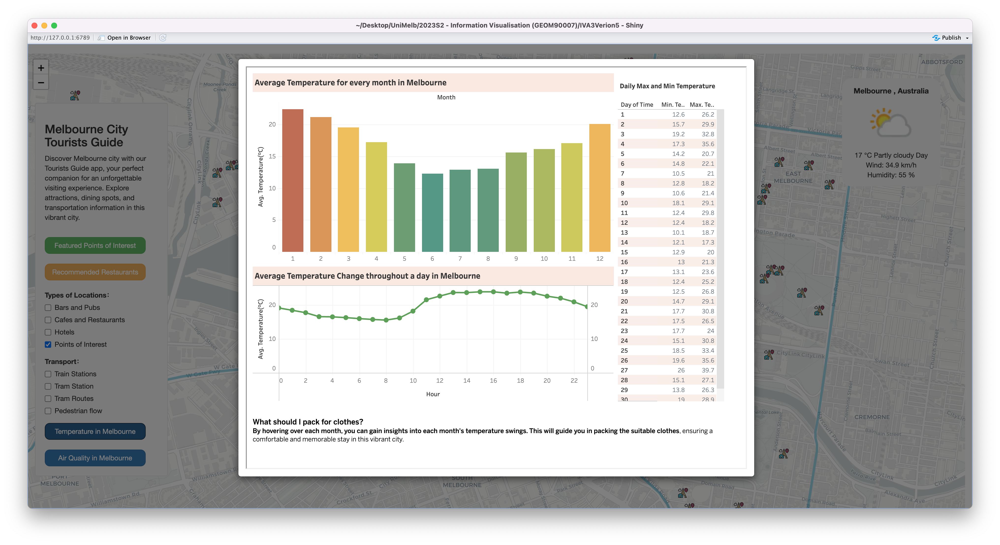

# Overview
The app is user-friendly and tourists can explore tourist information on an interactive map. The main interactions include clicking on buttons, multiple choice boxes, the search bar and popups display detailed information.
# Features of Design

- The user-friendly interactive map allows tourists to explore location information for multiple categories. A bubble map is used to show the real-time average daily pedestrian flow on the street, with the larger the bubble representing heavier footfall. The search bar allows tourists to search information based on the input keywords.
- Tableau Dashboards to show Melbourne's temperature and air quality.





# Running the application

Please make sure the packages listed below have installed in your devices and you can access internet!

```R
library(dplyr)
library(ggplot2)
library(leaflet)
library(shiny)
library(shinyjs)
library(sf)
library(jsonlite)
library(tidyr)
library(httr)
```

You can run the script below to install if you have not

```R
libraries <- c('shiny','shinyjs','sf','jsonlite','dplyr','leaflet','ggplot2','tidyr', 'httr')
new_libraries <- libraries[!(libraries %in% installed.packages()[,"Package"])]
if(length(new_libraries)) install.packages(new_libraries)
```

Please make sure the R studio have installed in your device the download link : https://posit.co/downloads/

Now open and Run by using R studio
